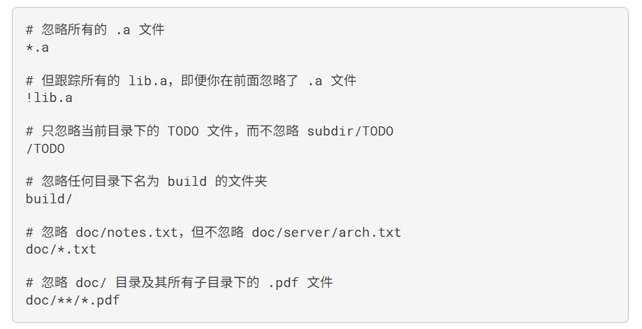

Notes

by Nemo

2023.9.24

# 前言
此篇笔记将基于一本叫做Pro Git的书，自顶向下讲述git的使用。  
学习资源：
- [Pro Git](https://git-scm.com/book/en/v2)  /  [Pro Git中文版](https://git-scm.com/book/zh/v2)，推荐阅读1-5章
- [ohshitgit](https://ohshitgit.com/)，简短的介绍了如何从 Git 错误中恢复
- [Git for Computer Scientists](https://eagain.net/articles/git-for-computer-scientists/)，简短的介绍了 Git 的数据模型
- [git-from-the-bottom-up](https://jwiegley.github.io/git-from-the-bottom-up/)，详细的介绍了 Git 的实现细节
- [explain-git-in-simple-words](https://xosh.org/explain-git-in-simple-words/)，如其名
- [学习git的在线游戏](https://learngitbranching.js.org/)，挺好玩的
- [用动图展示10大Git命令](https://zhuanlan.zhihu.com/p/132573100)，一篇精美文章

## 我们为什么需要git
git是一个分布式版本控制软件  
在项目开发中，它能方便我们跟踪文件的信息，包括谁修改了它、变化了哪些部分；可以让我们更方便地添加、调试新功能，如果不行还可以回退到上一个版本；可以让我们更加方便地团队协作，和其他人进行信息交互，加快工作效率  
世界上最大的开源代码社区github就是基于git的  
从短期好处来看，学习git可以方便你进行代码的管理（有一个自己的代码仓库，可以和别人）

# intro
## 分布式版本控制系统
在这类系统中，客户端并不只提取最新版本的文件快照， 而是把代码仓库完整地镜像下来，包括完整的历史记录。 这么一来，任何一处协同工作用的服务器发生故障，事后都可以用任何一个镜像出来的本地仓库恢复。 因为每一次的克隆操作，实际上都是一次对代码仓库的完整备份。

SHA-1 哈希
Git 有三种状态，你的文件可能
处于其中之一： 已提交（committed）、已修改（modified） 和 已暂存（staged）
• 已修改表示修改了文件，但还没保存到数据库中。
• 已暂存表示对一个已修改文件的当前版本做了标记，使之包含在下次提交的快照中。
• 已提交表示数据已经安全地保存在本地数据库中

Git 前的配置
/etc/gitconfig 文件: 包含系统上每一个用户及他们仓库的通用配置。 如果在执行 git config 时带上
--system 选项，那么它就会读写该文件中的配置变量。 （由于它是系统配置文件，因此你需要管理员或
超级用户权限来修改它。）
2. ~/.gitconfig 或 ~/.config/git/config 文件：只针对当前用户。 你可以传递 --global 选项让 Git
读写此文件，这会对你系统上 所有 的仓库生效。
3. 当前使用仓库的 Git 目录中的 config 文件（即 .git/config）：针对该仓库。 你可以传递 --local 选
项让 Git 强制读写此文件，虽然默认情况下用的就是它。。 （当然，你需要进入某个 Git 仓库中才能让该选
项生效。）

请记住，你工作目录下的每一个文件都不外乎这两种状态：已跟踪 或 未跟踪。 已跟踪的文件是指那些被纳入了
版本控制的文件，在上一次快照中有它们的记录，在工作一段时间后， 它们的状态可能是未修改，已修改或已
30
放入暂存区。简而言之，已跟踪的文件就是 Git 已经知道的文件

D:\learning\git>git status
On branch master
Untracked files:
  (use "git add <file>..." to include in what will be committed)
        notes.md
        progit.pdf

nothing added to commit but untracked files present (use "git add" to track)

git status

使用命令 git add 开始跟踪一个文件

暂存已修改的文件
现在我们来修改一个已被跟踪的文件。 如果你修改了一个名为 CONTRIBUTING.md 的已被跟踪的文件，然后运
行 git status 命令，会看到下面内容：

需要运行 git add 命令。 这是个多功能命令：可以用它开
始跟踪新文件，或者把已跟踪的文件放到暂存区，还能用于合并时把有冲突的文件标记为已解决状态等

状态简览
git status -s 

忽略文件
一般我们总会有些文件无需纳入 Git 的管理，也不希望它们总出现在未跟踪文件列表。 通常都是些自动生成的文
件，比如日志文件，或者编译过程中创建的临时文件等。 在这种情况下，我们可以创建一个名为 .gitignore
的文件，列出要忽略的文件的模式。

文件 .gitignore 的格式规范如下：
• 所有空行或者以 # 开头的行都会被 Git 忽略。
• 可以使用标准的 glob 模式匹配，它会递归地应用在整个工作区中。
• 匹配模式可以以（/）开头防止递归。
• 匹配模式可以以（/）结尾指定目录。
• 要忽略指定模式以外的文件或目录，可以在模式前加上叹号（!）取反。
所谓的 glob 模式是指 shell 所使用的简化了的正则表达式。 星号（*）匹配零个或多个任意字符；[abc] 匹配
任何一个列在方括号中的字符 （这个例子要么匹配一个 a，要么匹配一个 b，要么匹配一个 c）； 问号（?）只
匹配一个任意字符；如果在方括号中使用短划线分隔两个字符， 表示所有在这两个字符范围内的都可以匹配
（比如 [0-9] 表示匹配所有 0 到 9 的数字）。 使用两个星号（**）表示匹配任意中间目录，比如 a/**/z 可以
匹配 a/z 、 a/b/z 或 a/b/c/z 等。

[gitignore](https://github.com/github/gitignore)

在最简单的情况下，一个仓库可能只根目录下有一个 .gitignore 文件，它递归地应用到整
个仓库中。 然而，子目录下也可以有额外的 .gitignore 文件。子目录中的 .gitignore
文件中的规则只作用于它所在的目录中。 （Linux 内核的源码库拥有 206 个 .gitignore 文
件。）
多个 .gitignore 文件的具体细节超出了本书的范围，更多详情见 man gitignore

git diff
此命令比较的是工作目录中当前文件和暂存区域快照之间的差异。 也就是修改之后还没有暂存起来的变化内
容

